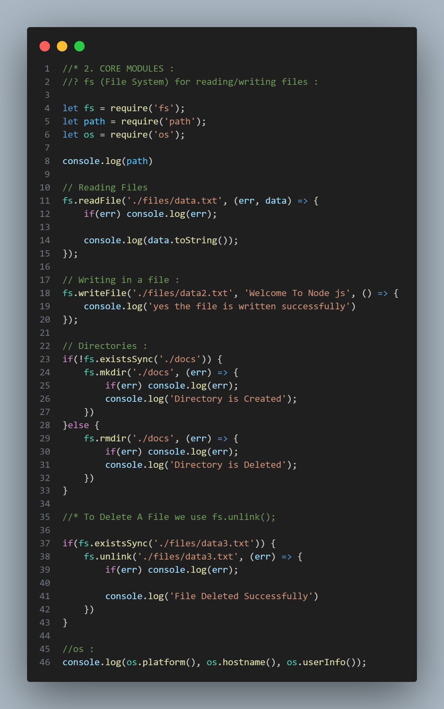
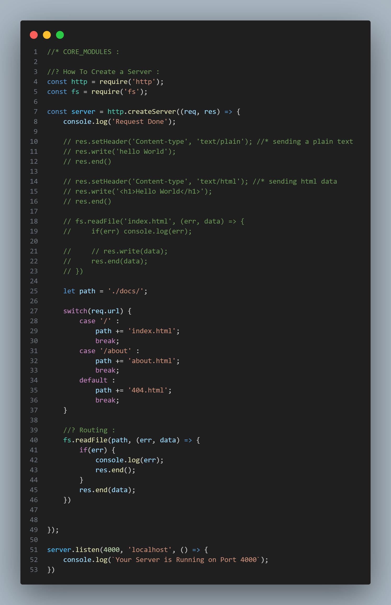

# What is Node js ? 
Node.js is an open-source, cross-platform runtime environment that allows you to run JavaScript on the server side.

## Break Down : 
### JavaScript on the backend: 
Traditionally, JavaScript was used only in browsers. Node.js lets you run it outside the browser, so you can build backend services like APIs, web servers, or tools.

### Built on V8: 
It uses Chrome’s V8 JavaScript engine (the same one used in the browser) to execute code.

### Non-blocking I/O: 
Node.js uses an event-driven, asynchronous architecture, making it very efficient and suitable for handling many connections at once (like in chat apps or real-time dashboards).

### npm (Node Package Manager): 
Comes with Node.js, giving access to thousands of libraries and tools.

# 🟡 2. Core Modules : 
### fs (File System) for reading/writing files 
### fpath for handling file paths 
### os for system info 

### http for creating a simple server : 
